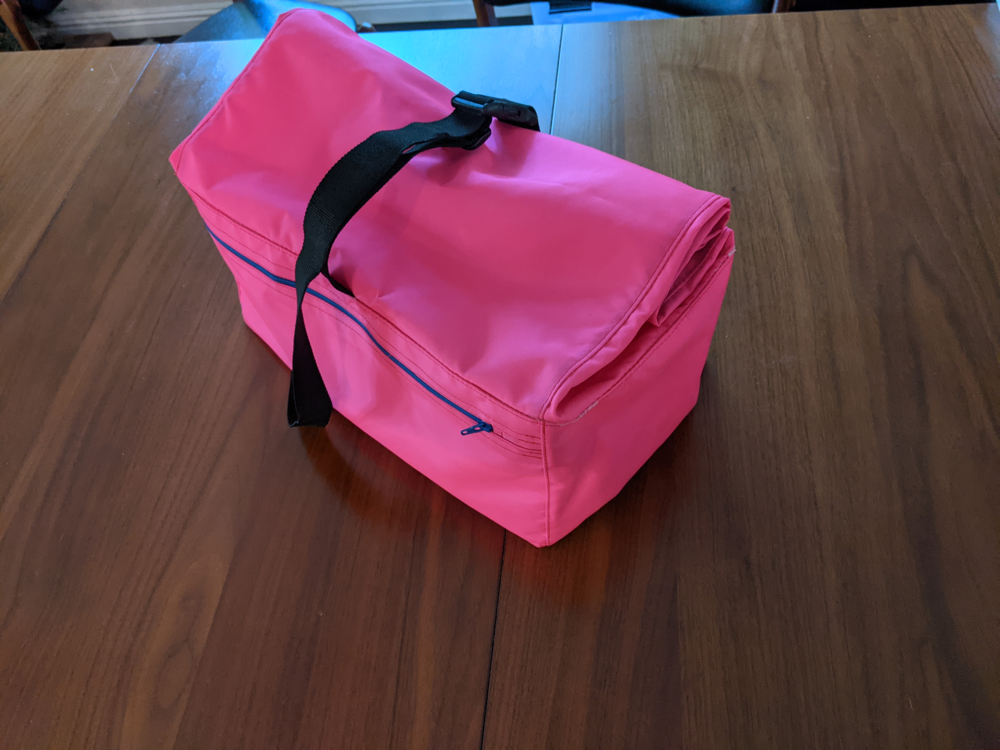
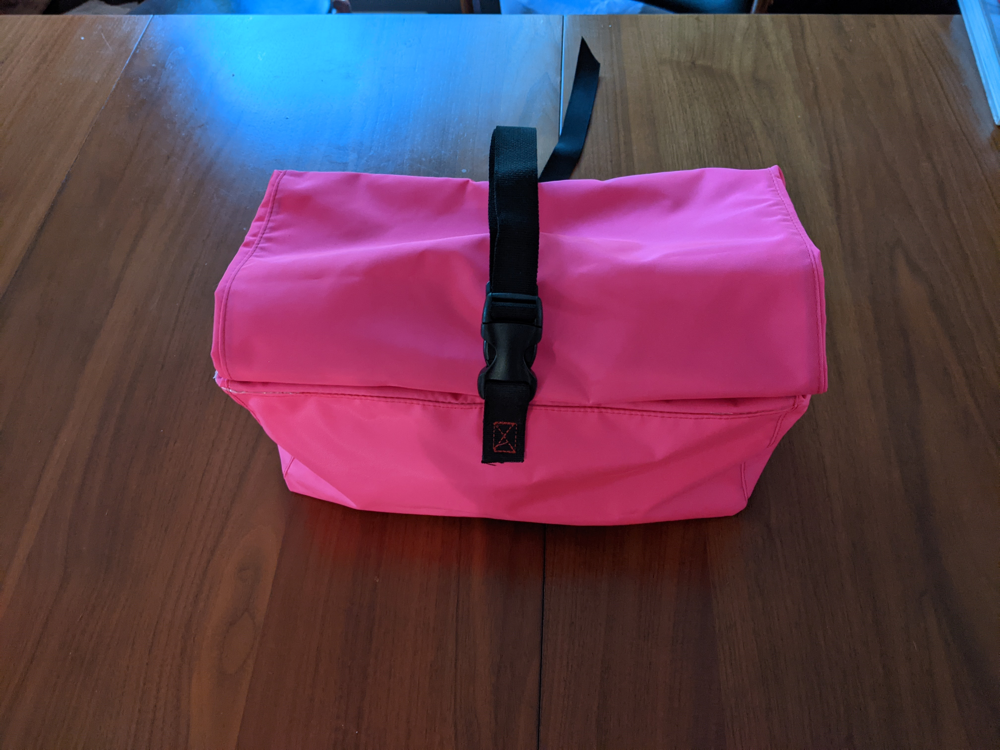
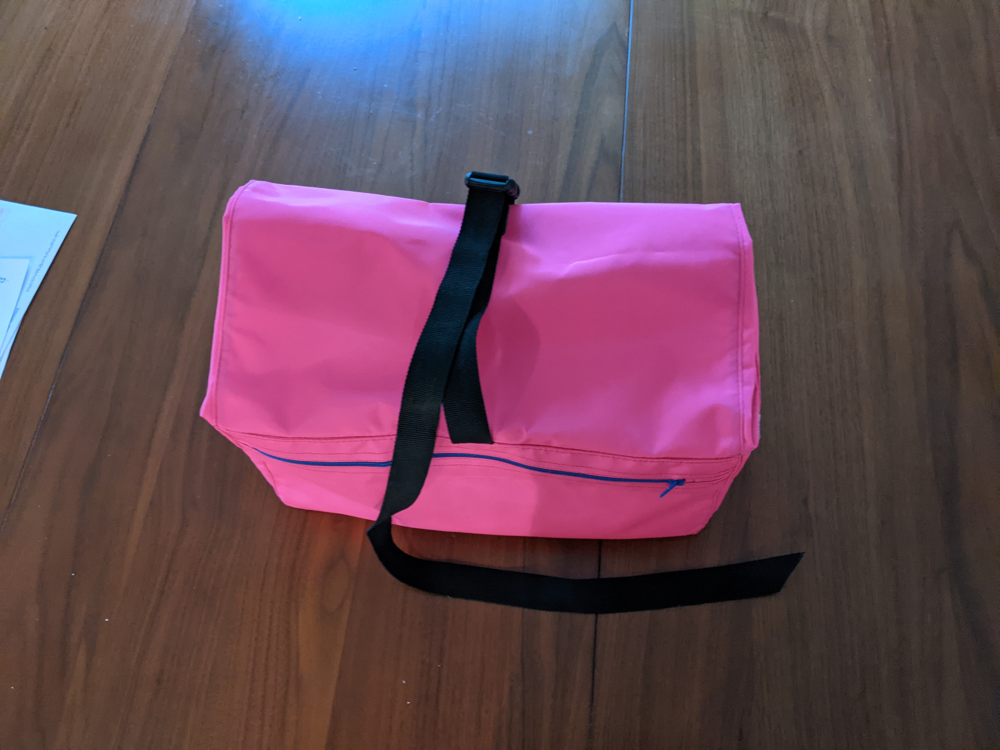

# Wald basket bag

This repository has instructions on how to build a basket bag to fit in a Wald 137 basket. 

The finished bag has:
- One full-width zipper pocket facing the rider
- Two inner side pockets (for phones, etc)
- A roll-top closure
- Webbing across the base for attachment to a basket

The finished bag's lower section is 14" wide x 8.5" long x 6" tall. The upper (roll-top) section is 12" tall.

There are three pages:

- [Materials list](materials.md): A full list of materials, with links and a discussion of which fabric to use.
- [Instructions](instructions.md): Build instructions
- [Tips and tricks](tips.md): Sewing tips and tricks, including links to video tutorials.

